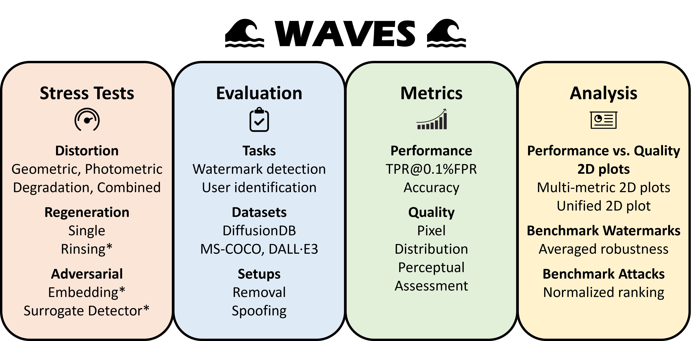

# WAVES: Benchmarking the Robustness of Image Watermarks



## Overview
WAVES (Watermark Analysis via Enhanced Stress-testing) introduces a novel benchmark for assessing the robustness of image watermarking techniques against a diverse range of attacks. This project aims to overcome the limitations of current evaluation methods by integrating detection and identification tasks within a standardized evaluation protocol. The benchmark encompasses traditional image distortions, advanced diffusive, and novel adversarial attacks, providing a comprehensive testbed for watermark robustness.

## Abstract
Image watermarking techniques have been pivotal for copyright and digital rights management. However, their robustness under various attack scenarios remains a critical concern. WAVES addresses this by offering a detailed benchmark comprising 26+ attack scenarios, from common image distortions to sophisticated adversarial interventions. Our evaluation protocol introduces a normalized score for image quality degradation and a systematic approach to assess watermark detection performance post-attack. The findings reveal new vulnerabilities in modern watermarking algorithms, paving the way for the development of more resilient watermarking systems.

## Evaluation Highlights
- **Diverse Attack Scenarios:** WAVES tests watermarks against a wide array of attacks, including compression, cropping, digital-to-analog conversion, and advanced adversarial techniques.
- **Performance vs. Quality Analysis:** The benchmark introduces a 2D plot analysis for juxtaposing watermark detection performance with image quality degradation, offering insights into the trade-offs between robustness and perceptual quality.
- **Comprehensive Toolkit:** Alongside the benchmark, WAVES provides a suite of tools for researchers and practitioners to evaluate the robustness of their watermarking techniques comprehensively.

## Code Structure Overview

This section provides an overview of the main components of our codebase. The structure is designed to facilitate the understanding, use, and extension of our benchmarking tool for evaluating the robustness of image watermarks.

## Key Directories

### `adversarial`
Contains scripts and models for generating adversarial attacks on watermarked images. It includes:
- `embedding.py`: Script for embedding adversarial patterns into images.
- `feature_extractors`: Modules for extracting features from images using various models (CLIP, VAEs, ResNet18).
- `surrogate_models`: Pre-trained models used as surrogates to simulate watermark detectors.
- `surrogate.py` & `train.py`: Scripts for training surrogate models and adversarial training processes.

### `decoders`
Houses ONNX models for decoding watermarks from images, including decoders for stable signature and StegaStamp.

### `dev`
Development utilities for the project, including:
- Evaluation scripts (`eval.py`).
- Plotting utilities (`plot.py`).
- Data parsing and I/O operations (`io.py`, `parse.py`).

### `distortions`
Implements various image distortion functions used to simulate natural image modifications and evaluate watermark robustness.

### `metrics`
Contains implementations and wrappers for different image quality and performance metrics, including:
- `aesthetics.py`: Aesthetic evaluation of images.
- `lpips`: Perceptual image patch similarity (LPIPS) for assessing image quality degradation.
- `clean_fid`: FID score calculation for comparing image distributions.

### `regeneration`
Scripts for regenerating watermarked images, simulating a process where an attacker might attempt to remove or alter the watermark without degrading image quality significantly.

### `scripts`
Utility scripts for performing common tasks such as setting file permissions, decoding watermarks, and evaluating metric scores.

### `static/images`
Stores static images used in the project, including example outputs, performance plots, and visualizations of attack effects.

### `utils`
A collection of utility functions supporting various operations across the project, including data handling, image processing, and visualization.

## Other Components

- `app.py` & `cli.py`: Entry points for the web application and command-line interface, respectively, facilitating user interaction with the benchmarking tool.
- `requirements_*.txt`: Lists of Python package dependencies for different components of the project.
- `setup.py`: Setup script for installing the project as a Python package.

## External Dependencies

Folders such as `guided_diffusion`, `ldm`, and `tree_ring` contain code for specific watermarking or image generation techniques and are considered external dependencies. While not the focus of our project, they are integral to the watermarking and attack simulation processes.

---

This structure is designed to be modular, allowing for easy expansion and incorporation of new watermarking methods, attack types, and evaluation metrics. For detailed documentation on each component, refer to the corresponding README files within each directory.

Based on the provided `cli.py`, below is a guide for the Command Line Interface (CLI) that details its functionality and usage. This CLI is designed as a comprehensive tool for benchmarking watermark robustness, offering a variety of commands to facilitate evaluation and analysis.

## Getting Started with CLI

First, ensure that all dependencies are installed. This can be easily done using the provided shell script:

```bash
bash shell_scripts/install_dependencies.sh
```

This script sets up the necessary environment to run the watermark benchmarking tool.

## CLI Commands Overview

### General Command Structure

The CLI is structured around a main group with several subcommands. Each subcommand may support additional options and arguments. To invoke a command, use the following syntax:

```bash
python cli.py [COMMAND] [OPTIONS] [ARGS]
```

### Available Commands

- `version`: Displays the current version of the CLI tool.

  ```bash
  python cli.py version
  ```

- `status`: Checks and summarizes the status of attacks. This command supports the `--all` option to run on all image directories.

  ```bash
  python cli.py status [--all] [ARGS]
  ```

- `reverse`: Reverses stable diffusion on attacked images. Supports the `--all` option for batch processing and `--dry` for a dry run without actual execution.

  ```bash
  python cli.py reverse [--all] [--dry] [ARGS]
  ```

- `decode`: Decodes messages from images, with an option to process all image directories.

  ```bash
  python cli.py decode [--all] [ARGS]
  ```

- `metric`: Measures image quality metrics. This command can also operate on all image directories.

  ```bash
  python cli.py metric [--all] [ARGS]
  ```

- `chmod`: Grants group write access to all your files, ensuring that the necessary permissions are set for file manipulation.

  ```bash
  python cli.py chmod
  ```

- `space`: (For debugging) Starts the Gradio plotting interface, allowing for interactive analysis and visualization.

  ```bash
  python cli.py space
  ```

### Using the `--all` Option

Several commands (`status`, `reverse`, `decode`, `metric`) accept an `--all` option, enabling users to apply the command across all image directories. This batch processing feature is especially useful for large-scale evaluations.

### Debugging and Utilities

The `chmod` and `space` commands are utility and debugging aids. `chmod` is crucial for setting appropriate permissions, while `space` provides a graphical interface for data exploration.

### Extending CLI Functionality

New commands and options can be added to the CLI by defining additional `@click.command` functions in the `cli.py` script. This modular design allows for easy expansion to meet evolving requirements of watermark robustness benchmarking.

---

For detailed help on each command, including available options and arguments, use the `--help` option, e.g., `python cli.py status --help`. This guide provides a concise yet comprehensive overview of the CLI's capabilities, designed to facilitate efficient watermark evaluation workflows.


## Contributions
WAVES is an open platform for the research community. Contributions in the form of new attacks, watermarking techniques, or improvements to the evaluation protocol are welcome.

## License
This project is licensed under the terms of the MIT license.